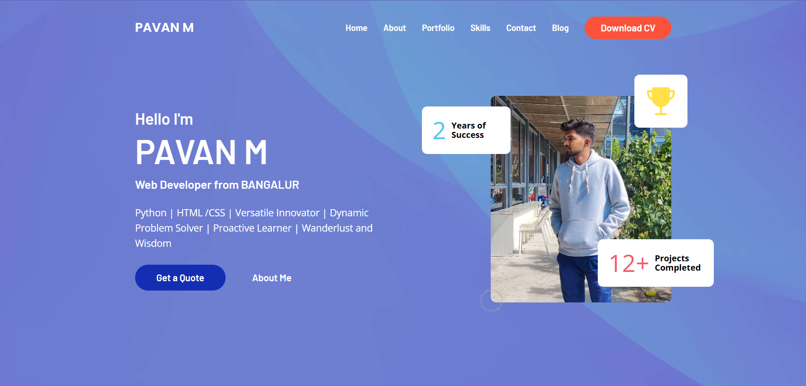

  Fully responsive personal portfolio website, <br />Responsive for all devices, built using HTML, CSS, and JavaScript.

  <a href="https://github.com/pavanmahadev/portfolio-pavan.git"><strong>➥ Live Demo</strong></a>

</div>

<br />

### Demo Screeshots



### Prerequisites

Before you begin, ensure you have met the following requirements:

* [Git](https://github.com/pavanmahadev/portfolio-pavan.git"Download Git") must be installed on your operating system.

### Run Locally

To run **Portfolio** locally, run this command on your git bash:

Linux and macOS:

```bash
sudo git clone https://github.com/pavanmahadev/portfolio-pavan.git
```

Windows:

```bash
git clone https://github.com/pavanmahadev/portfolio-pavan.git
```


